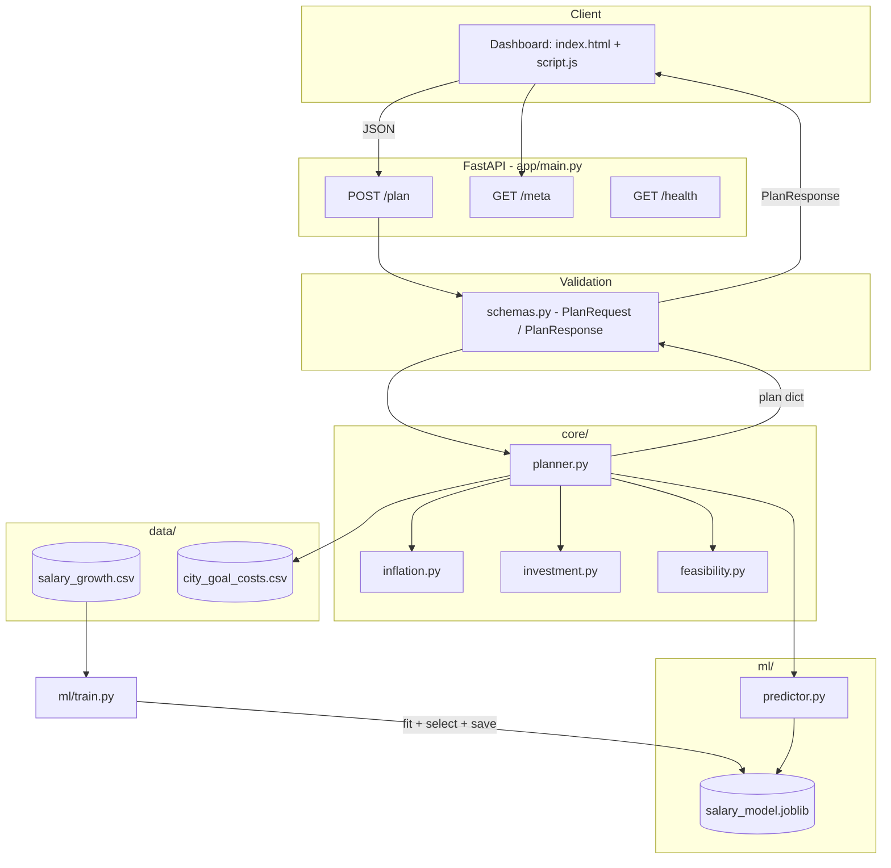
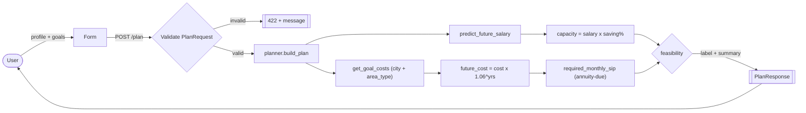

# Project Report — AI-Powered Financial Goal Planner & Salary Growth Predictor

**Type:** Local academic project (no RAG, no paid APIs, no cloud).
**Stack:** Python, FastAPI, pandas, NumPy, scikit-learn, Joblib, HTML/CSS/JS.

> **Disclaimer:** This is an **educational financial-planning simulation**. All
> predictions and assumptions (6% inflation, 8% salary growth, 12% investment
> return) are illustrative and do **not** guarantee any real financial outcome.

---

## 1. Objective

Help a fresher understand whether three life goals — **Marriage, Car, Home** —
are financially reachable, by (a) predicting their **5-year future salary** with
ML and (b) computing the inflation-adjusted cost and required monthly investment
(SIP) for each goal, then classifying overall feasibility.

## 2. Architecture

## 3. Data Flow (DFD)

## 4. Modules

| Module | Responsibility |
| --- | --- |
| `app/config.py` | Paths, feature/target names, financial constants, disclaimer. |
| `app/ml/train.py` | Load + clean data, build OHE pipeline, split, train LR + DT, evaluate, select, save. |
| `app/ml/predictor.py` | Load pipeline once (cached), predict salary, expose known categories. |
| `app/core/inflation.py` | Future cost at 6%. |
| `app/core/investment.py` | Saving capacity + annuity-due SIP. |
| `app/core/feasibility.py` | Achievable / Challenging / Highly Challenging. |
| `app/core/planner.py` | Orchestrate plan; load costs by city + area type. |
| `app/schemas.py` | Pydantic validation with friendly, list-driven errors. |
| `app/main.py` | FastAPI routes + static dashboard. |

## 5. ML methodology

- **Target:** `Future Salary` — the salary 5 years out. The provided
  `salary_data.csv` had no such column, so `data/generate_salary_growth.py`
  builds a **synthetic** `Future Salary` (growth varied by city/age with seeded
  noise). The dataset is illustrative; the metrics below are honest for it.
- **Features:** `Age`, `Current Salary` (numeric) + `City` (one-hot encoded
  inside a scikit-learn `Pipeline` via `ColumnTransformer`). Experience is **not**
  a feature.
- **Split:** 80/20, fixed `random_state = 42` (reproducible).
- **Models:** Linear Regression and Decision Tree Regressor.
- **Metrics & selection:** MAE and R²; **lower MAE wins**, higher R² breaks ties.

**Result (this dataset):**

| Model | Test MAE | R² |
| --- | --- | --- |
| **Linear Regression (selected)** | 3806.94 | 0.986 |
| Decision Tree | 7650.00 | 0.917 |

R² is high because Current Salary strongly predicts Future Salary — an honest,
expected relationship, not fabricated accuracy. Small (100-row) dataset.

## 6. Financial methodology

- **Future cost:** `Current Cost × (1.06)^years`.
- **Salary growth:** implied 5-year CAGR (`current → predicted future`) projects
  salary at each goal's horizon (informational).
- **Saving capacity:** `Current Salary × Saving% / 100`.
- **Required SIP (annuity-due):**
  `P = (FV × i) / (((1 + i)^n − 1) × (1 + i))`, with `i = 0.12/12`, `n = years×12`.
- **Feasibility:** surplus ≥ 0 → Achievable; shortfall ≤ 25% of capacity →
  Challenging; otherwise Highly Challenging.

## 7. Documented assumptions

| Assumption | Value | Note |
| --- | --- | --- |
| Inflation | 6% / year | Fixed. |
| Salary target | Future Salary (5-yr) | Synthetic training data; growth via model-implied CAGR. |
| Investment return | 12% / year | Assumption, not a guarantee. |
| Contribution timing | Start of month | Annuity-due. |
| Area type default | `Central` | User may override. |
| Feasibility band | 25% of capacity | Challenging threshold. |

## 8. API

- `POST /plan` → full plan (see `README.md` for a full request/response example).
- `GET /meta` → dropdown options (cities, educations, job roles, area types).
- `GET /health` → `{ "status": "ok", "model_ready": true }`.

Example (Bangalore, ₹45k current, 30% saving): predicted 5-yr salary
₹84,145.95, combined SIP ₹117,259.68 vs capacity ₹13,500 →
**Highly Challenging**.

## 9. Testing

`python -m pytest -q` → **24 passed**, covering inflation, investment (incl. an
annuity-due FV round-trip), feasibility boundaries, and the API (happy path +
five validation failures).

## 10. Requirement checklist

| Requirement | Satisfied by |
| --- | --- |
| No RAG / paid APIs / cloud | Fully local; `requirements.txt` has only local libs. |
| Experience is not a feature | `config.FEATURE_COLUMNS = Age, City, Current Salary`. |
| Predict future salary via ML | `ml/train.py` (target `Future Salary`), `ml/predictor.py`. |
| City encoded (OHE in Pipeline) | `train.build_pipeline` (ColumnTransformer + OneHotEncoder). |
| Fixed random_state | `config.RANDOM_STATE = 42`. |
| Two models (LR + DT) | `train.train_and_select`. |
| Evaluate MAE + R² | `train.evaluate`. |
| Selection: lower MAE, R² tie-break | `train.select_better`. |
| Save Joblib, load once | `train` saves; `predictor.get_model` (lru_cache). |
| Inflation fixed 6% | `config.INFLATION_RATE`, `inflation.future_cost`. |
| No hard-coded city costs | `planner.get_goal_costs` reads `city_goal_costs.csv`. |
| No fake accuracy / guarantees | Real metrics reported; disclaimer everywhere. |
| Disclaimer everywhere relevant | `config.DISCLAIMER` in `/meta`, `/plan`, app metadata, UI, docs. |

## 11. Limitations

- The `Future Salary` target is **synthetic** (generated), so metrics reflect
  that dataset, not a real labour market. Small (100-row) dataset.
- Return and inflation are fixed assumptions, not forecasts.
- Costs are illustrative city/area figures from the provided CSV.

## 12. Disclaimer

This project is for **education only**. It does not constitute financial advice,
and its assumptions do not guarantee any real financial outcome.
